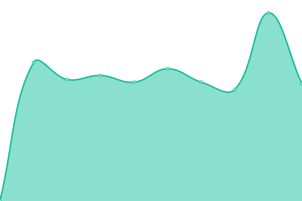
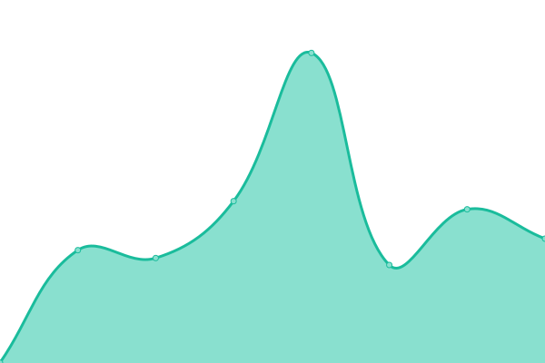

# [📈 Live Status](https://evintoh.github.io/upptime): <!--live status--> **🟧 Partial outage**

This repository contains the open-source uptime monitor and status page for [Evin Toh](https://evintoh.github.io/upptime), powered by [Upptime](https://github.com/upptime/upptime).

With [Upptime](https://upptime.js.org), you can get your own unlimited and free uptime monitor and status page, powered entirely by a GitHub repository. We use [Issues](https://github.com/evintoh/upptime/issues) as incident reports, [Actions](https://github.com/evintoh/upptime/actions) as uptime monitors, and [Pages](https://evintoh.github.io/upptime) for the status page.

<!--start: status pages-->
<!-- This summary is generated by Upptime (https://github.com/upptime/upptime) -->
<!-- Do not edit this manually, your changes will be overwritten -->
<!-- prettier-ignore -->
| URL | Status | History | Response Time | Uptime |
| --- | ------ | ------- | ------------- | ------ |
|  [BMS SG](https://sg.bookmyshow.com/) | 🟥 Down | [bms-sg.yml](https://github.com/evintoh/upptime/commits/HEAD/history/bms-sg.yml) | 

 163ms
     
 | 

<a href="https://evintoh.github.io/upptime/history/bms-sg">0.00%</a>
    

|  [BMS ID](https://id.bookmyshow.com/) | 🟥 Down | [bms-id.yml](https://github.com/evintoh/upptime/commits/HEAD/history/bms-id.yml) | 

 165ms
     
 | 

<a href="https://evintoh.github.io/upptime/history/bms-id">0.00%</a>
    

|  [BMS MY](https://my.bookmyshow.com/) | 🟥 Down | [bms-my.yml](https://github.com/evintoh/upptime/commits/HEAD/history/bms-my.yml) | 

 163ms
     
 | 

<a href="https://evintoh.github.io/upptime/history/bms-my">0.00%</a>
    

|  [BMS SG Pos](http://pos-sg.bigtix.io/) | 🟥 Down | [bms-sg-pos.yml](https://github.com/evintoh/upptime/commits/HEAD/history/bms-sg-pos.yml) | 

 0ms
     
 | 

<a href="https://evintoh.github.io/upptime/history/bms-sg-pos">0.00%</a>
    

|  [BMS SG Admin](http://admin-sg.bigtix.io/) | 🟩 Up | [bms-sg-admin.yml](https://github.com/evintoh/upptime/commits/HEAD/history/bms-sg-admin.yml) | 

 832ms
     
 | 

<a href="https://evintoh.github.io/upptime/history/bms-sg-admin">100.00%</a>
    

<!--end: status pages-->

[**Visit our status website →**](https://evintoh.github.io/upptime)

## 📄 License

- Powered by: [Upptime](https://github.com/upptime/upptime)
- Code: [MIT](./LICENSE) © [Evin Toh](https://evintoh.github.io/upptime)
- Data in the `./history` directory: [Open Database License](https://opendatacommons.org/licenses/odbl/1-0/)
